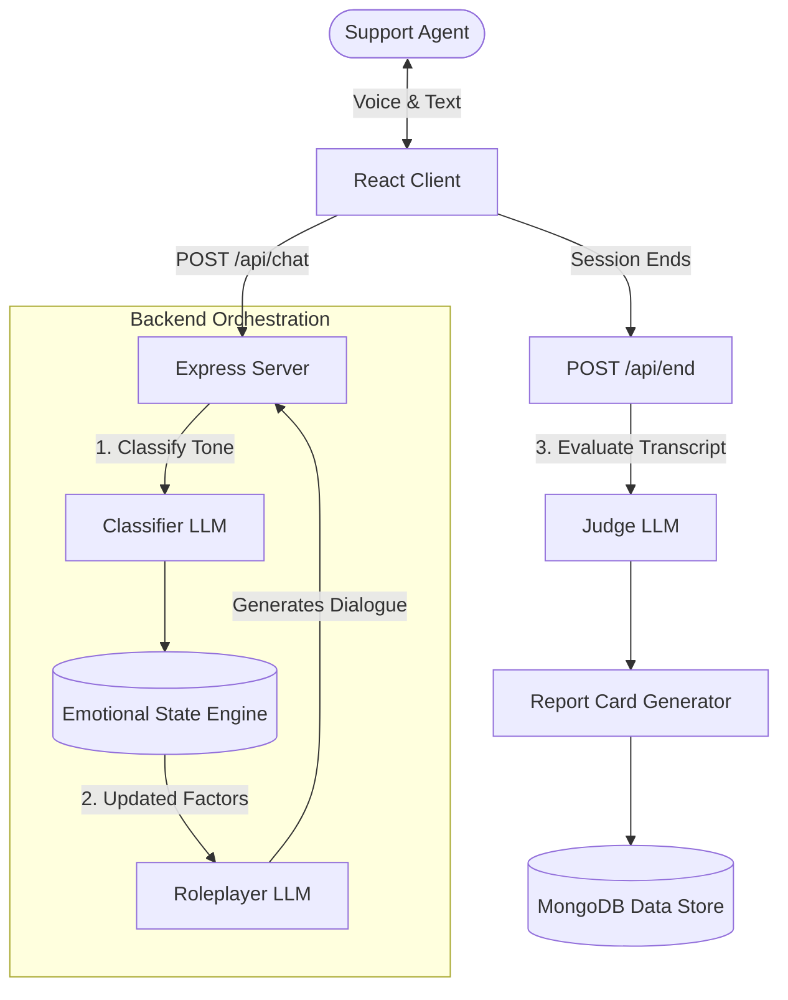

# RageRoom: The AI De-escalation Simulator

*“Build Something That Couldn't Have Existed Two Years Ago”*

## Track: Agents & Automation
RageRoom goes beyond standard chatbots by featuring systems that decide and act. The simulated customer maintains a dynamic internal state, reacts emotionally to the trainee's tone, and possesses the autonomy to aggressively end the call (hang up) if their patience reaches zero.

---

## 1. The Five Questions ("Why Shortlist Us?")

### What problem, and who exactly has it?
**Target:** Customer Support Trainees and BPO QA Managers.
**Problem:** Currently, support agents train by roleplaying with other employees (which is awkward and unrealistic) or reading static scripts. When they get on a real call with a screaming customer, they panic. RageRoom provides a zero-stakes, hyper-realistic environment to practice handling raw hostility.

### What is the non-obvious hard part?
Keeping the AI "Customer" from breaking character and acting like a helpful assistant. Standard LLMs are heavily instruction-tuned to be polite. When the user (playing the agent) yells at the AI, the AI instinctively tries to apologize and de-escalate. We had to build a custom prompt architecture that completely isolates the LLM from its "assistant" identity, forcing it to maintain a 10/10 Frustration state and actively threaten to hang up.

### What did you build versus what did the API give you?
**The API gave us:** Raw text generation.
**We built:**
- A **Dynamic Emotional State Engine** (Frustration, Patience, Trust, Loyalty) that fluctuates in real-time.
- An **Auto-submitting Voice-Activity Detection (VAD)** loop using the Web Speech API that simulates an uninterrupted phone call.
- A **Deterministic Report Card Generator** that algorithmically calculates a score out of 100 based on the net-change in the customer's emotional factors.
- **Automated Hang-ups:** Logic that forcefully cuts the user off and fails the session if the customer's patience threshold is breached.

### Why does this break if you remove the AI?
Without the AI, this is just a static multiple-choice quiz. Hard-coded logic cannot detect when a trainee uses a passive-aggressive tone, nor can it dynamically generate a context-aware insult based on the specific CRM data of the scenario. The AI is the core engine, not a decoration.

### What breaks at ten thousand users?
- **Web Speech API Limits:** We rely on the browser's native STT/TTS, which can be aggressively rate-limited if 10,000 concurrent sessions run from the same enterprise IP.
- **Context Window Costs:** The state classifier runs on *every single turn*. At 10,000 active users having 20-turn conversations, input token costs scale exponentially. We would need to truncate chat history heavily or switch to a fine-tuned, self-hosted 8B model.

---

## 2. Constraints That Force Originality

**Constraint 1: Two models, not one**
We utilize multi-agent orchestration. A hidden `Classifier` model silently observes the agent's message to categorize their behavior (e.g., "dismissive"). This output mathematically alters the customer's hidden state. The `Roleplayer` model then receives those updated parameters to generate the dialogue. Finally, an independent `Judge` model evaluates the entire transcript to generate feedback.

**Constraint 2: Not already the top Google result**
Search: *"Customer support training simulator with angry AI avatars"*
1. **ZenDesk Training:** Static articles and multiple-choice quizzes. (Difference: We have real-time dynamic voice conversations).
2. **SecondLife / VR Training:** Expensive corporate VR setups with pre-recorded actors. (Difference: We use generative AI for infinite, unscripted scenario variations).
3. **Gong.io / CallMiner:** They analyze real calls *after* they happen. (Difference: We provide a safe sandbox to fail *before* talking to real customers).

---

## 3. Architecture Diagram



---

## 4. Failure Log (Engineering Maturity)

**What we tried that failed:**
- **Relying entirely on LLM for grading:** We initially asked the Judge model to return a score out of 100. It failed completely—the LLM would give wildly inconsistent scores (giving a 90 to terrible agents just because they said "sorry"). We threw it out and built an *algorithmic* score based on the mathematical delta of the State Engine, using the LLM only for qualitative feedback.
- **Web Speech Synthesis cancellations:** We tried using `speechSynthesis.cancel()` to interrupt the AI when the user spoke over it. This caused a catastrophic browser bug on macOS that permanently muted the TTS engine until the browser was restarted. We had to remove interruptions entirely and implement a strictly turn-based lock.

**What our system still gets wrong:**
- **Voice-Activity Detection Thresholds:** The browser STT sometimes submits empty strings if the user pauses for more than 1.5 seconds mid-sentence, causing the AI to reply to half a thought. 

**What we'd fix with another week:**
- Implement WebSockets for true full-duplex bi-directional audio (allowing the AI to yell over the user in real-time) rather than relying on the choppy HTTP Request + Web Speech API combo.
- Add a tiny evaluation harness (as recommended in the brief) with 20 test cases to automatically verify that the prompt guardrails are holding up against assistant-behavior regression.

---

## Setup & Run Instructions

**Prerequisites:** Node.js, MongoDB, Groq API key

1. **Backend**
   ```bash
   cd server
   npm install
   cp .env.example .env
   # Add your GROQ_API_KEY to .env
   node server.js
   ```

2. **Frontend**
   ```bash
   cd client
   npm install
   npm run dev
   ```
   Visit `http://localhost:5173`. Make sure your microphone and volume are enabled!
